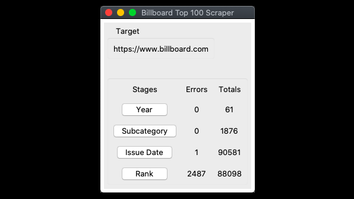

# Billboard Top 100 Scraper
Scrape the song rankings from billboard.com



## Purpose/Goal
To scrape the archived rankings and use those in a larger project for customizing English language lessons.

## Operation
```bash
# run
    ./run
# test
    ./Test
```

## Tech/Libraries Used
* Python3
* Beautiful Soup

## Problems/Solutions
* The website has changed since I made this, which means that I would need to rewrite the urls in the code to match the new site structure.

## More Information
Read the [project wiki](https://github.com/wmcooper2/billboardtop100/wiki) on GitHub.
